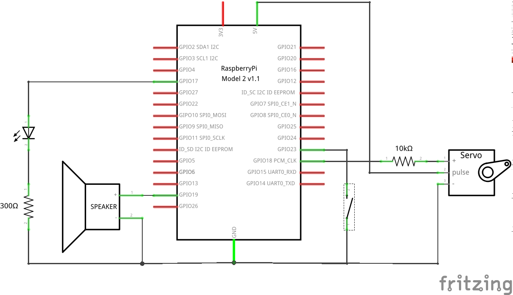

# Medical Dispenser: Mechanism

Python program which runs on a [Raspberry Pi 2](https://www.raspberrypi.org/products/raspberry-pi-2-model-b/) to dispense sensitive medications with strictly-regulated scheduling and dosing, which are configurable by a patient's doctor.

## Physical Build

The Raspberry Pi needs to be connected to the internet, either through ethernet or through wifi.

### Component Schematic

